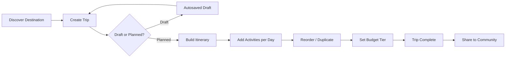
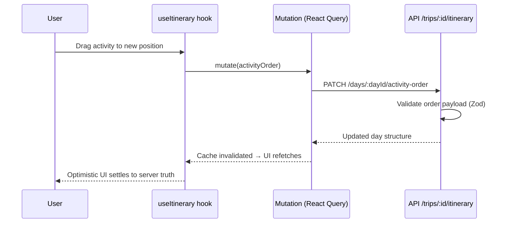
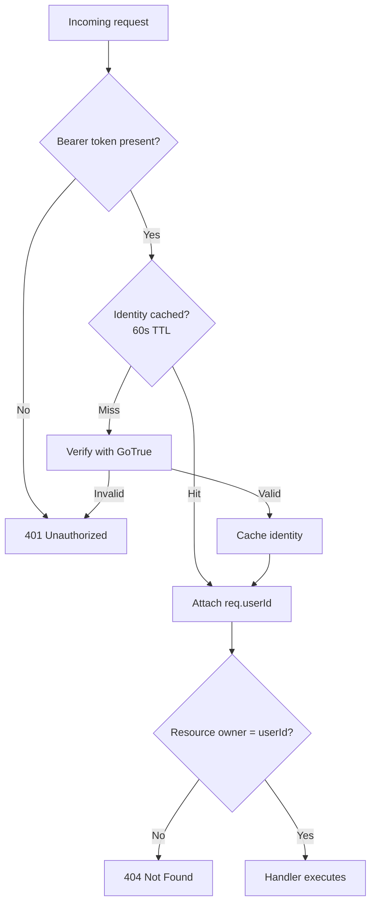
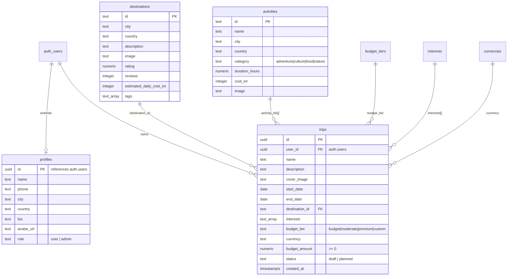

<a id="top"></a>

# 🌍 GlobeTrotter

<p align="center">
  <b>GlobeTrotter — Plan Trips. Build Itineraries. Explore the World.</b><br>
  <i>A travel planning platform: day-by-day itineraries, budget tracking, destination discovery,<br>and a travel community — built as a full-stack monorepo.</i>
</p>

<p align="center">
  
  
  
  
  
  
  
  
  
  
  
  
</p>

---

## 🧠 Problem Statement

### The Trip-Planning Mess

Planning a trip today means juggling **ten browser tabs, screenshots, spreadsheets, and chat threads**. Nobody has a single place where destinations, day plans, budgets, and bookings live together.

```
Current reality:   Pinterest boards → Screenshots → Excel budgets → Group chats → Chaos
What we need:      Discover → Plan → Itinerary → Budget → Share → Travel
```

| The Problem | The Reality | The Impact |
|:-----------:|:-----------:|:----------:|
| Scattered Research | Destination info spread across blogs, reels, and bookmarks | Hours lost re-finding saved places |
| No Day Structure | Itineraries live in notes apps with no ordering or timing | Overbooked days, missed attractions |
| Budget Blindness | Costs tracked manually or not at all | Overspending discovered mid-trip |
| Zero Reusability | Every traveler rebuilds the same research from scratch | Community knowledge stays locked in DMs |

### How GlobeTrotter Solves This

GlobeTrotter replaces scattered planning with a **unified trip workspace** — discover curated destinations, compose day-by-day itineraries with drag-and-drop activities, track budget by tier, and share completed trips with a community of travelers.

```
GlobeTrotter:  Discover → Create Trip → Build Itinerary → Track Budget → Calendar → Share
```

> [!NOTE]
> GlobeTrotter is not another destination gallery. Every module feeds the itinerary engine — saved destinations convert into trip stops, suggested activities become scheduled items, and every change persists against the user's account with strict row-level ownership.

---

## 🚀 Why GlobeTrotter?

### The Vision

Trip planning should feel like **composing a story, not filling forms**. Three principles drive the product:

| Principle | What It Means |
|-----------|---------------|
| **Plan-First UX** | Every screen pushes toward a concrete next action — save a place, add an activity, lock a date. |
| **Structured Freedom** | Drag-and-drop days, activities, and stops with server-validated ordering — freeform but never chaotic. |
| **Ownership by Design** | PostgreSQL row-level security guarantees a user only ever touches their own trips, drafts, and settings. |

### What Makes It Different

| Feature | Typical Travel App | GlobeTrotter |
|---------|-------------------|--------------|
| Discovery | Endless scroll | Curated catalog + trending/popular/regional filters |
| Itinerary | Static checklist | Per-day activity cards, reorder, duplicate days/stops |
| Draft Safety | Lose everything on refresh | Autosaved draft state (`useDraftAutosave`) |
| Budget | One total number | Tier-based setup (budget/moderate/premium/custom) + per-activity costs |
| Sharing | Screenshot dumps | Share-trip flow with public snapshot card |
| Data Safety | "Trust us" | Enforced at the database via Supabase RLS policies |

---

## ✨ Key Features

### 🖥️ Core Modules

| Feature | Description |
|---------|-------------|
| **🏠 Landing** | Hero, features grid, how-it-works, dashboard preview, community preview, CTA — animated reveal-on-scroll sections. |
| **📊 Dashboard** | Trip overview, progress tracking, popular destinations, regional selections, travel insights, recent activity, quick actions, notification menu, global search. |
| **🧳 Trips** | Create trips with cover image upload, interest selection, budget tier setup, travel dates; My Trips with status tabs (draft/planned/archived), bulk actions, filters, export. |
| **🗺️ Itinerary Builder** | Day-by-day builder — add/reorder/duplicate activities (`@dnd-kit`), day navigation, stops panel, completion flow. Every mutation persists immediately. |
| **🔍 Explore** | Search destinations & activities, category/region/duration/budget filters, trending + popular rails, destination detail pages, save-to-collection, add-to-trip dialog. |
| **📅 Calendar** | Month/week grids and day agenda composed from trip dates, activities, and stops — conflict detection with resolution dialog. |
| **👥 Community** | Travel feed with post composer, comments, media, shared-trip cards, trending sidebar, profile dialogs. |
| **💰 Budget** | Tier-based budget setup (budget / moderate / premium / custom) with currency support and cost breakdowns. |
| **🔔 Notifications** | In-app center with unread counts, read/unread/read-all flows, persisted preferences. |
| **⚙️ Settings & Profile** | Account settings, profile editing with image upload, password change, destructive-action confirmations, help & support page. |

### 🔐 Security & Access

| Feature | Details |
|---------|---------|
| **Supabase GoTrue Auth** | Register, login, logout, session restore, forgot/reset password |
| **Admin Registration** | Register with admin secret code (`ADMIN_SECRET_CODE`) to get admin role instantly |
| **JWT Bearer Verification** | Every protected route verifies the token against GoTrue — not just signature shape |
| **Verified-Token Cache** | SHA-256-keyed 60-second identity cache (max 1,000 entries) to survive refetch bursts under rate limits |
| **Rate-Limit Retry** | Paced single retry on transient GoTrue throttling before surfacing `429` |
| **Row-Level Security** | All tables enforce `auth.uid() = user_id` policies at the database level |
| **Zod Validation** | Request bodies validated schema-first on every mutating endpoint |
| **Scoped Queries** | Backend additionally scopes every query by `req.userId` — defense in depth beyond RLS |
| **Secret Hygiene** | `service_role` key lives only in Render env settings / gitignored `.env`; blueprint ships with `sync: false` placeholders |

---

## 📸 Screens & Modules

| Area | Route(s) | Description |
|------|----------|-------------|
| 🏠 **Landing** | `/` | Hero, features, workflow, showcase, stats bar, theme toggle |
| 🔐 **Auth** | `/login` · `/register` · `/forgot-password` · `/reset-password` | Password strength meter, show/hide toggle, mock-token reset flow for local testing |
| 📊 **Dashboard** | `/dashboard` | Welcome section, trip overview, insights, quick actions, notifications menu |
| 🧳 **My Trips** | `/trips` | Status tabs, list/grid toggle, bulk select + delete/archive, skeletons |
| ➕ **Create Trip** | `/trips/create` (`/trips/:tripId/edit` reuses the form) | Multi-step form — destination search, interests, dates, budget, cover image |
| 📄 **Trip Details** | `/trips/:tripId` | Trip overview with action bar |
| 🔗 **Share Trip** | `/trips/:tripId/share` | Share-trip flow |
| 🗺️ **Itinerary Builder** | `/trips/:tripId/itinerary` | Day navigation, activity cards, drag reorder, stops panel, view switcher |
| 💰 **Budget** | `/trips/:tripId/budget` | Tier selection, amount, currency, breakdown |
| 🔍 **Explore** | `/explore` · `/explore/search` · `/explore/destinations/:destinationId` | Filters, hero, empty states, detail skeleton→content, add-to-trip |
| ⭐ **Saved** | `/saved` | Wishlist of saved destinations/activities |
| 📅 **Calendar** | `/calendar` | Month grid, week grid, day agenda, event chips, conflict dialog |
| 👥 **Community** | `/community` | Feed, composer, comments, shared trips, trending sidebar |
| 🔔 **Notifications** | `/notifications` | Full-page center with filters + mark-read flows |
| 👤 **Profile / Settings** | `/profile` · `/settings` | Personal info, avatar upload, sessions, preferences |
| ❓ **Help & Support** | `/help` | FAQ + contact surface |
| 🛡️ **System States** | `/404` · `/403` · `/500` · `/maintenance` · `/offline` | Dedicated error/maintenance/network pages |
| 🔒 **Admin** | `/admin` | Role-gated admin console — dashboard stats, user/trip/destination/activity management, analytics, role promotions (register with admin secret code to access) |

---

## 🎨 Design System

The complete design language is specified once in [`theme.md`](./theme.md) — the single source of truth.

| Rule | Implementation |
|------|----------------|
| **Semantic tokens only** | Colors defined as CSS variables in `frontend/src/index.css` (`:root` / `.dark`) |
| **Tailwind exposure** | Tokens surfaced as utilities via Tailwind v4's `@theme inline` |
| **Green = actions** | Primary action color across the app |
| **Blue = travel** | Navigation, discovery, destination surfaces |
| **Semantic status colors** | Success/warning/destructive states consistent everywhere |
| **No hardcoded hex** | Components consume tokens; raw values are forbidden by convention |
| **Dark mode** | Class strategy with theme provider + landing-page toggle |

---

## 🛠️ Tech Stack

### Frontend

| Technology | Version | Purpose | Why We Chose It |
|------------|---------|---------|-----------------|
| **React** | ^19.2 | UI runtime | Concurrent rendering, mature ecosystem |
| **Vite** | ^7.3 | Dev server + build | Instant HMR, native ESM, manual chunk splitting |
| **TypeScript** | ~6.0 | Type safety | Strict types across all 231 source files |
| **Tailwind CSS** | v4.3 | Styling | CSS-variable design tokens via `@theme inline` |
| **TanStack Query** | ^5 | Server-state cache | Typed query keys, invalidation graph, stale-time control |
| **TanStack Table** | ^9 | Data tables | Headless sorting/filtering for trip lists |
| **React Router** | ^6.28 | Routing | Protected/guest route guards, lazy routes |
| **Radix UI** | latest | Accessible primitives | Dialogs, dropdowns, selects, tooltips — WAI-ARIA compliant |
| **@dnd-kit** | ^6/^10 | Drag & drop | Keyboard-accessible reordering for itinerary items |
| **Zod** | ^3.25 | Form validation | Schema-first forms with `@hookform/resolvers` |
| **React Hook Form** | ^7.86 | Forms | Uncontrolled perf, minimal rerenders |
| **Framer Motion** | ^11 | Animation | Landing reveals, micro-interactions (5 modules) |
| **Sonner** | ^2.0 | Toasts | Non-blocking feedback layer (28 modules) |
| **Axios** | ^1.19 | HTTP client | Interceptor-ready central instance |
| **Vitest + Testing Library** | ^4.1 | Tests | jsdom unit tests for services, schemas, components |
| **oxlint** | ^1.75 | Linting | Fast Rust-based linter |

### Backend

| Technology | Version | Purpose | Why We Chose It |
|------------|---------|---------|-----------------|
| **Node.js** | ≥20 | Runtime | Modern ESM, wide hosting support |
| **Express** | ^4.19 | REST framework | Minimal core, middleware ecosystem |
| **TypeScript** | ~6.0 | Type safety | Strict API contracts end-to-end |
| **Supabase JS** | ^2.112 | DB client + GoTrue | Managed Postgres, auth, RLS enforcement |
| **Zod** | ^4.4 | Request validation | Schema-first body parsing with precise error paths |
| **tsx** | ^4.19 | Dev runner | Watch-mode TypeScript execution |
| **dotenv** | ^16.4 | Config | Env-based secrets, validated at boot |

### Infrastructure

| Technology | Purpose |
|------------|---------|
| **Render Blueprint** | One-command API deploy (`render.yaml`) — org-instructed setup: API hosted, frontend runs locally |
| **Supabase Postgres** | Managed database with row-level security |
| **Supabase GoTrue** | JWT issuance and verification |
| **Vite Dev Proxy** | Local frontend forwards `/api/*` to the deployed API — fresh clones work with zero `.env` |

---

## 🏗️ System Architecture

Per hackathon-organization instructions, the frontend runs locally while the API and database are hosted:

```
┌─────────────────────────────────────────────────────────────────────┐
│                     🖥️ FRONTEND — localhost:5173                    │
│                                                                     │
│   React 19 · Vite 7 · TypeScript · Tailwind v4 · TanStack Query    │
│                                                                     │
│   ┌────────┐ ┌──────────┐ ┌───────────┐ ┌────────────┐             │
│   │ Landing│ │Dashboard │ │Trips +    │ │ Explore +  │             │
│   │ + Auth │ │+ Insights│ │Itinerary  │ │Calendar    │             │
│   ├────────┤ ├──────────┤ ├───────────┤ ├────────────┤             │
│   │Community│ │Budget    │ │Notification│ │ Profile + │            │
│   │Feed     │ │Setup     │ │Center      │ │ Settings  │            │
│   └────────┘ └──────────┘ └───────────┘ └────────────┘             │
│                                                                     │
│        Feature modules → hooks (useQuery/useMutation)               │
│              → typed service layer → persistence                    │
│                                                                     │
│   Vite dev proxy:  /api/*  →  deployed GlobeTrotter API            │
└──────────────────────────────┬──────────────────────────────────────┘
                               │ HTTPS + JSON + Bearer JWT
                               ▼
┌─────────────────────────────────────────────────────────────────────┐
│                  ☁️ API — Render (globetrotter-api)                 │
│                                                                     │
│   Express 4 + TypeScript · Zod-validated · CORS allow-list         │
│                                                                     │
│   Middleware pipeline:                                              │
│     CORS → JSON parser → Route → requireAuth (GoTrue JWT)          │
│         → Zod schema parse → Handler → Error normalizer            │
│                                                                     │
│   ┌──────┐ ┌──────┐ ┌───────────┐ ┌──────────┐ ┌───────────────┐  │
│   │ Auth │ │Trips │ │ Itinerary │ │Explore + │ │ Notifications │  │
│   │Router│ │Router│ │  Router   │ │ Catalog  │ │  + Settings   │  │
│   └──────┘ └──────┘ └───────────┘ └──────────┘ └───────────────┘  │
│   ┌──────────────────┐ ┌──────────────────────────────────────┐   │
│   │ Admin Router     │ │ Dashboard + Explore Router           │   │
│   └──────────────────┘ └──────────────────────────────────────┘   │
│                                                                     │
│   Health check: GET /api/health                                     │
└──────────────────────────────┬──────────────────────────────────────┘
                               │ service_role key (server-only)
                               ▼
              ┌────────────────────────────────┐
              │      🗄️ SUPABASE POSTGRES      │
              │                                │
              │  profiles · trips · catalog    │
              │  Row-Level Security enforced   │
              │  auth.uid() = user_id          │
              └────────────────────────────────┘
```

---

## 🔄 Project Workflow

### Trip lifecycle



### Itinerary mutation flow



### Ownership check (every request)



---

## 📁 Folder Structure

```
GlobeTrotter/
│
├── frontend/                        # 🎨 React SPA (runs locally)
│   ├── src/
│   │   ├── components/
│   │   │   ├── ui/                  # 21 Radix-based primitives
│   │   │   ├── landing/             # 20 landing sections
│   │   │   ├── auth/                # Forms, strength meter, uploads
│   │   │   ├── layout/              # AppShell, Sidebar, ThemeProvider
│   │   │   ├── icons/               # Brand icon set
│   │   │   ├── ErrorBoundary.tsx
│   │   │   └── OfflineBanner.tsx
│   │   │
│   │   ├── features/                # Feature-sliced modules
│   │   │   ├── auth/                # Context, guards, schemas, service
│   │   │   ├── trips/               # Service, hooks, schemas, 30+ components
│   │   │   ├── calendar/            # Grid/agenda components, conflict logic
│   │   │   ├── community/           # Feed, posts, composer, sharing
│   │   │   ├── dashboard/           # 12 widget components
│   │   │   ├── explore/             # Search, filters, detail views
│   │   │   ├── notifications/       # Center + preferences
│   │   │   └── settings/            # Preferences service + types
│   │   │
│   │   ├── pages/                   # Route-level screens
│   │   ├── services/api/            # Axios client (Bearer interceptor)
│   │   ├── lib/                     # api.ts, query-client.ts, utils
│   │   ├── hooks/                   # useNetworkStatus
│   │   ├── config/                  # Landing configuration
│   │   └── test/                    # Vitest setup
│   ├── vite.config.ts               # Dev proxy → deployed API + chunk splitting
│   └── package.json
│
├── backend/                         # ⚙️ Express API (deployed on Render)
│   ├── src/
│   │   ├── server.ts                # Bootstrap + env validation
│   │   ├── app.ts                   # CORS · JSON · router · error handlers
│   │   ├── config/env.ts            # Typed environment
│   │   ├── middleware/
│   │   │   ├── auth.ts              # GoTrue JWT verify + 60s identity cache
│   │   │   └── errorHandler.ts      # Normalized API errors
│   │   ├── routes/                  # 9 route modules + health
│   │   └── lib/                     # supabase admin client, ApiError
│   ├── sql/                         # schema.sql + 3 migrations
│   ├── scripts/
│   │   ├── api-smoke-test.mjs       # End-to-end API test suite
│   │   └── seed-catalog.ts          # Destinations/activities seeder
│   └── package.json
│
├── render.yaml                      # Render Blueprint (org-instructed deploy)
├── theme.md                         # Design system — single source of truth
├── globe.md                         # This document
└── README.md                        # Quick-start oriented README
```

---

## 🧩 Frontend Feature Architecture

Every feature follows the same four-layer slice — this consistency is what keeps 231 files navigable:

```
Feature folder (e.g. features/trips/)
│
├── *.types.ts        # Domain types (TripRecord, ActivitySuggestion…)
├── *.schema.ts       # Zod form/validation schemas (+ tests)
├── *.data.ts         # Seed/catalog datasets
├── *.service.ts      # Async data-access functions (persistence-abstracted)
├── use*.ts           # React Query hooks — the ONLY layer touching services
└── components/       # Pure presentation, fed by hooks
```

| Layer | Rule |
|-------|------|
| **Types** | Single source of truth per feature; no inline duplicates in components |
| **Schemas** | Every form validates through Zod; schemas are unit-tested |
| **Services** | Fully async signatures mirroring REST semantics — latency, errors, return shapes match an HTTP call |
| **Hooks** | Centralized query keys (`tripsKeys`, etc.) so mutations invalidate exactly the right caches |
| **Components** | No direct fetch/service calls — props in, events out |

> [!NOTE]
> The service layer is deliberately persistence-abstracted: identical function signatures serve either browser-backed storage (instant demo/offline mode) or HTTP endpoints. The backend implements each corresponding route under `/api/v1` (see [API Reference](#-api-reference)), and the central Axios instances (`lib/api.ts`, `services/api/client.ts`) ship with Bearer-token interceptor wiring ready for cutover.

---

## 🗄️ Database Schema

### Entity Overview



### Supporting Tables

| Table | Purpose |
|-------|---------|
| `trip_itineraries` | One JSONB itinerary document per trip (migration v2) |
| `budget_tiers` | Label, cost multiplier, split percentages, sort order |
| `interests` | Curated interest labels for trip personalization |
| `currencies` | Code, label, symbol for multi-currency budgets |
| `app_config` | JSONB key-value store for runtime configuration |

### Migrations

Applied in order via Supabase SQL Editor:

1. `sql/schema.sql` — base schema + RLS + lookup function
2. `sql/migration-v2.sql` — itinerary documents (JSONB), bookmarks, dashboard content
3. `sql/migration-v3.sql` — explore catalog, community feed, calendar events
4. `sql/migration-v3-notifications.sql` — notifications table + per-user settings blob

All scripts are **idempotent** — safe to re-run (`IF NOT EXISTS` / `OR REPLACE` throughout).

---

## 🔒 Row-Level Security (RLS)

Every table enforces ownership **at the database level**, independent of application logic:

```sql
-- Example: trips are invisible to other users, even with direct DB access
alter table public.trips enable row level security;

create policy "trips_select_own" on public.trips
  for select using (auth.uid() = user_id);

create policy "trips_insert_own" on public.trips
  for insert with check (auth.uid() = user_id);

create policy "trips_update_own" on public.trips
  for update using (auth.uid() = user_id);

create policy "trips_delete_own" on public.trips
  for delete using (auth.uid() = user_id);
```

| Table class | Policy |
|-------------|--------|
| `profiles` | Select/insert/update own row only |
| `trips` | Full CRUD scoped to `auth.uid() = user_id` |
| Catalog tables (`destinations`, `activities`, `budget_tiers`, `interests`, `currencies`, `app_config`) | World-readable (`select using (true)`); writes restricted to `service_role` |

**Privilege escalation guard:** the `get_auth_email()` helper is a `security definer` function revoked from `public`, `anon`, and `authenticated` — executable by `service_role` only.

---

## 🌐 API Reference

Base URL: `https://<render-service>.onrender.com/api` (all responses are JSON; protected routes require `Authorization: Bearer <JWT>`).

### System

| Method | Endpoint | Description |
|--------|----------|-------------|
| GET | `/health` | Service status, uptime, Supabase configuration flag |

### Auth — `/auth`

| Method | Endpoint | Description |
|--------|----------|-------------|
| POST | `/register` | Create account (GoTrue signup + profile row); pass `adminCode` to register as admin |
| POST | `/login` | Identifier login (email **or** username via secure email lookup) |
| POST | `/logout` | Revoke session server-side |
| GET | `/me` | Current authenticated profile |
| POST | `/forgot-password` | Issue password-reset flow |
| POST | `/reset-password` | Complete reset with token |

### Trips — `/trips` *(auth required)*

| Method | Endpoint | Description |
|--------|----------|-------------|
| GET | `/` | List all owned trips (newest first) |
| POST | `/` | Create trip (full Zod-validated draft) |
| GET | `/:id` | Fetch single owned trip |
| PATCH | `/:id` | Narrow patch (status flip) or full edit-form update |
| PUT | `/:id` | Complete replacement save |
| PUT | `/:id/draft` | Upsert-style draft autosave (creates record if needed) |
| POST | `/:id/duplicate` | Deep-copy into a fresh editable trip |
| DELETE | `/:id` | Delete owned trip |
| POST | `/bulk-delete` | Delete up to 200 ids — reports `{ deletedIds, failedIds }` partial failures |
| PATCH | `/bulk-archive` | Archive/unarchive batch |

### Itinerary — `/trips/:id/itinerary/*` *(auth required)*

| Method | Endpoint | Description |
|--------|----------|-------------|
| GET | `/:id/itinerary` | Full day/activity tree for a trip |
| PUT | `/:id/itinerary` | Replace itinerary structure |
| POST | `/:id/activities` | Add activity |
| PATCH/DELETE | `/:id/activities/:activityId` | Update / remove activity |
| POST | `/:id/activities/:activityId/duplicate` | Copy activity |
| POST | `/:id/activities/:activityId/move` | Move between days |
| DELETE | `/:id/days/:dayId` | Remove day |
| PATCH | `/:id/days/:dayId/activity-order` | Persist drag-reorder result |
| POST | `/:id/days/:dayId/activities` | Bulk-add to a day |
| POST | `/:id/days/:dayId/duplicate` | Duplicate whole day |
| GET/POST | `/:id/stops` | Read / add route stops |
| PATCH | `/:id/stops/order` | Persist stop ordering |
| PATCH/DELETE | `/:id/stops/:stopId` | Update / remove stop |
| POST | `/:id/complete` | Mark trip complete |

### Catalog — public reads

| Method | Endpoint | Description |
|--------|----------|-------------|
| GET | `/destinations` | Browse catalog destinations |
| GET | `/destinations/recommended` | Personalized recommendations |
| GET | `/activities` | List activities |
| GET | `/activities/search?q=&category=` | Search activities |
| GET | `/meta` | Budget tiers, interests, currencies in one call |

### Explore — `/explore`

| Method | Endpoint | Description |
|--------|----------|-------------|
| GET | `/destinations/trending` | Trending rail + timestamp |
| GET | `/destinations/popular` | Popular destinations |
| GET | `/destinations/by-region/:regionId` | Regional browse |
| GET | `/destinations/by-category/:category` | Category browse |
| GET | `/recommended?filter=` | Interest/budget/popular modes |
| GET | `/search?q=` | Unified destination+activity search |
| GET | `/suggestions` | Typeahead suggestions |
| GET | `/destinations/:id/detail` | Full detail page payload |
| GET | `/regions` | Region definitions |

### User-scoped — `/dashboard`, `/users/me/*` *(auth required)*

| Method | Endpoint | Description |
|--------|----------|-------------|
| GET | `/dashboard` | Aggregated dashboard snapshot |
| GET | `/users/me/bookmarks` | Bookmark list |
| POST | `/users/me/saved-destinations` | Save a destination |
| POST | `/users/me/saved-activities` | Save an activity |

### Notifications & Settings *(auth required)*

| Method | Endpoint | Description |
|--------|----------|-------------|
| GET | `/notifications` | List with unread count |
| POST | `/notifications/read` | Mark specific read |
| POST | `/notifications/unread` | Mark specific unread |
| POST | `/notifications/read-all` | Mark all read |
| DELETE | `/notifications/:id` | Dismiss one |
| DELETE | `/notifications` | Clear notifications |
| GET/PUT | `/users/me/settings` | Persisted per-account preferences |

### Admin — `/admin` *(auth + admin role required)*

| Method | Endpoint | Description |
|--------|----------|-------------|
| GET | `/stats` | Dashboard stats — user/trip/destination/activity counts, trends, activity feed |
| GET | `/users` | Paginated user list with search, role filter, sort |
| GET | `/users/:userId` | Single user detail with trip count |
| PATCH | `/users/:userId/role` | Promote or demote user role |
| GET | `/trips` | Paginated trip list with search, status filter, sort |
| GET | `/trips/:tripId` | Single trip detail with itinerary |
| GET | `/destinations` | Paginated destination list |
| POST | `/destinations` | Create destination |
| PATCH | `/destinations/:destId` | Update destination |
| DELETE | `/destinations/:destId` | Delete destination |
| GET | `/activities` | Paginated activity list with category filter |
| POST | `/activities` | Create activity |
| PATCH | `/activities/:activityId` | Update activity |
| DELETE | `/activities/:activityId` | Delete activity |
| GET | `/analytics` | User growth, trip trends, budget distribution, status breakdown |

---

## 🔐 Authentication & Security

### Token verification — not just signature parsing

```typescript
// middleware/auth.ts — every protected route:
//   1. Extract bearer token
//   2. Check SHA-256-keyed identity cache (60s TTL, max 1000 entries)
//   3. On miss → verify against Supabase GoTrue (real round-trip)
//   4. Attach req.userId / req.authEmail to the request
//   5. Transient rate-limit → one paced retry, then normalized 429
```

| Layer | Protection |
|-------|-----------|
| Transport | HTTPS everywhere (Render TLS termination) |
| Identity | GoTrue JWT verified server-side per request (cached 60s) |
| Authorization | `req.userId` scoping on **every** query + RLS underneath |
| Input | Zod schema parsing with precise `path: message` errors |
| Secrets | `service_role` never leaves the server; blueprint uses `sync: false`; `.env` gitignored |
| Admin Access | Register with `ADMIN_SECRET_CODE` env var; role enforced server-side via `requireAdmin` middleware |
| CORS | Explicit origin allow-list (localhost dev origins by default) |
| Errors | Normalized `{ code, message }` envelopes — no stack traces leaked |
| Frontend tokens | Stored in `localStorage` ("remember me") or `sessionStorage`; cleared on logout |

### Defense in depth

```
Client route guard (ProtectedRoute)
  └── Axios Bearer header
        └── Express requireAuth (GoTrue verify)
              └── requireAdmin (profiles.role check on every admin request)
                    └── Zod body validation
                          └── Handler scopes query by req.userId
                                └── Postgres RLS final gate
```

---

## ⚡ Request Lifecycle

```
Browser event
   │
   ▼
React component (presentation only)
   │
   ▼
useMutation / useQuery hook (features/*/use*.ts)
   │  queryKey-aware caching + invalidation
   ▼
Service function (async, validated shapes)
   │
   ▼
Axios instance (/api baseURL, 15s timeout)
   │  request interceptor → attaches Bearer token
   ▼
Vite dev proxy  /api/* → https://globetrotter-api.onrender.com
   │
   ▼
Express: CORS → JSON → requireAuth → Zod parse → handler
   │
   ▼
Supabase client (service_role) → Postgres with RLS
   │
   ▼
Response ← normalized error handler (on failure)
   │
   ▼
React Query cache update → optimistic UI settles
```

---

## 🚀 Getting Started

### ⚡ Quick Test — 2 minutes, zero config

No accounts needed, no `.env`, no local backend — the dev proxy targets the deployed API:

```bash
git clone https://github.com/Shubham-997800/GlobeTrotter
cd GlobeTrotter
npm install          # installs frontend + backend workspaces
npm run dev          # → http://localhost:5173
```

Sign up with any email + password (min 8 chars) and start planning.

> First request after API idle can take ~60s (free-tier cold start). Fast afterwards.

### 🔐 Creating an Admin Account

Admin accounts get access to the **Admin Console** (`/admin`) — a full management dashboard for users, trips, destinations, activities, analytics, and roles.

**During Registration:**

1. Go to `/register`
2. Scroll down and click **"Create Admin Account"** (expandable section)
3. Enter the admin secret code: `globetrotter-admin-2026`
4. Complete the rest of the form and submit
5. Your account is created with admin privileges

**Changing the Admin Secret Code:**

Set the `ADMIN_SECRET_CODE` environment variable in your backend `.env`:

```bash
ADMIN_SECRET_CODE=your-custom-secret-code
```

The default code is `globetrotter-admin-2026` — change this in production.

**What Admins Can Do:**

| Feature | Route | Description |
|---------|-------|-------------|
| Dashboard | `/admin` | Platform stats, popular destinations, activity feed, role breakdown |
| Users | `/admin/users` | List, search, filter, promote/demote roles |
| Trips | `/admin/trips` | Browse all trips across users |
| Destinations | `/admin/destinations` | Full CRUD — add, edit, delete destinations |
| Activities | `/admin/activities` | Full CRUD — add, edit, delete activities |
| Analytics | `/admin/analytics` | User growth, trip trends, budget distribution charts |
| Activity Feed | `/admin/activity` | Real-time feed of registrations and trip creations |
| Roles | `/admin/roles` | Permissions matrix and current role display |

### What to test

| Flow | Try this |
|------|----------|
| **Auth** | Sign up / log in / log out / forgot-password |
| **Trips** | Create trip → set dates, destination, budget tier |
| **Itinerary** | Add activities per day → drag-reorder → duplicate days |
| **Draft safety** | Kill the tab mid-create → reopen → draft restored |
| **Dashboard** | Progress, insights, quick actions |
| **Explore** | Search, filter by region/category, open detail, save |
| **Isolation** | Two accounts in two browser profiles — neither sees the other's data |
| **Admin Console** | Register with admin code → visit `/admin` → manage users, destinations, activities, view analytics |

### Full-stack local development

```bash
# 1. Configure the API
cp backend/.env.example backend/.env
#    fill in SUPABASE_URL, SUPABASE_ANON_KEY, SUPABASE_SERVICE_ROLE_KEY

# 2. Point the frontend at your local API
echo "VITE_API_PROXY_TARGET=http://localhost:4000" > frontend/.env

# 3. Install and run each workspace
npm install
npm run dev:api     # terminal 1 → http://localhost:4000
npm run dev         # terminal 2 → http://localhost:5173
```

### Scripts

| Script | Workspace | What it does |
|--------|-----------|--------------|
| `npm install` | root | Installs both workspaces |
| `npm run dev` | root/frontend | Vite dev server, proxies `/api` to deployed API |
| `npm run dev:api` | backend | tsx watch-mode API on `:4000` |
| `npm run build` | root | Production build of both workspaces |
| `npm run lint` | frontend | oxlint over `src/` |
| `npm run test` | frontend | Vitest suite (services, schemas, components) |
| `npm run typecheck` | backend | `tsc --noEmit` |
| `npm run seed` | backend | Seed destinations/activities catalog |
| `npm run smoke` | backend | End-to-end API smoke suite |

---

## ☁️ Deployment (Render Blueprint)

Per hackathon-organization instructions: **frontend runs locally; only the API is hosted.**

The repo ships a [`render.yaml`](./render.yaml) Blueprint — secrets stay out of git and are entered once in Render's dashboard:

1. Push the repo to GitHub.
2. Render Dashboard → **New → Blueprint** → pick the repo.
3. Fill in when prompted:
   - `SUPABASE_URL`
   - `SUPABASE_ANON_KEY`
   - `SUPABASE_SERVICE_ROLE_KEY`
   - `ADMIN_SECRET_CODE` *(default: `globetrotter-admin-2026`)*
   
   *(supabase.com/dashboard → project → Settings → API)*
4. Run SQL migrations from `backend/sql/` in order via the Supabase SQL Editor.
5. Point `vite.config.ts`'s proxy target (or `VITE_API_PROXY_TARGET`) at your service URL.

Build/start commands (handled by blueprint):

```yaml
buildCommand: npm ci --include=dev && npm run build
startCommand: npm start
healthCheckPath: /api/health
autoDeploy: true
```

> [!IMPORTANT]
> **Never commit real keys.** `service_role` bypasses all RLS — it must only exist in Render's environment settings or a gitignored local `backend/.env`. The blueprint intentionally ships `sync: false` placeholders.

Verify after deploy:

```
GET /api/health → { "status": "ok", "supabaseConfigured": true }
```

---

## 🧪 Testing

| Suite | Location | Runner | Covers |
|-------|----------|--------|--------|
| Unit — services | `features/**/*.service.test.ts` | Vitest | Trips service behavior, calendar composition |
| Unit — schemas | `features/**/*.schema.test.ts` | Vitest | Zod validation boundaries (auth, create-trip) |
| Unit — utils | `*.utils.test.ts` | Vitest | Date math, filtering, formatting |
| Component | `components/**/*.test.tsx` | Vitest + Testing Library + jsdom | Interactive components (password strength, draft status, travel dates) |
| API smoke | `backend/scripts/api-smoke-test.mjs` | Node | End-to-end endpoint verification against a running API |

```bash
npm run test --prefix frontend   # frontend suite
npm run smoke --prefix backend   # API smoke suite
```

---

## 🗺️ Roadmap

| Phase | Item |
|-------|------|
| Next | Wire remaining feature-service bodies to their live `/api/v1` counterparts (contracts already documented above) |
| Next | Real-time collaboration on shared itineraries (Supabase Realtime) |
| Later | Map-first itinerary planning (Leaflet dependency already declared) |
| Later | Offline-first PWA packaging with background sync |
| Later | Community moderation toolkit + reputation system |
| Idea | AI-assisted day-plan suggestions from saved interests |

---

## 👥 Team

| Member | Role |
|--------|------|
| **Mahesh Suthar** | Backend & Architecture — system design, Express API, Supabase schema, Render deployment |
| **Shubham Dangi** | Frontend Lead — itinerary builder, dashboard, landing experience |
| **Riddhi Shah** | Frontend — explore, community, notifications, settings modules |

---

<div align="center">

**GlobeTrotter** — *Stop collecting tabs. Start collecting stamps.* 🌍

</div>
